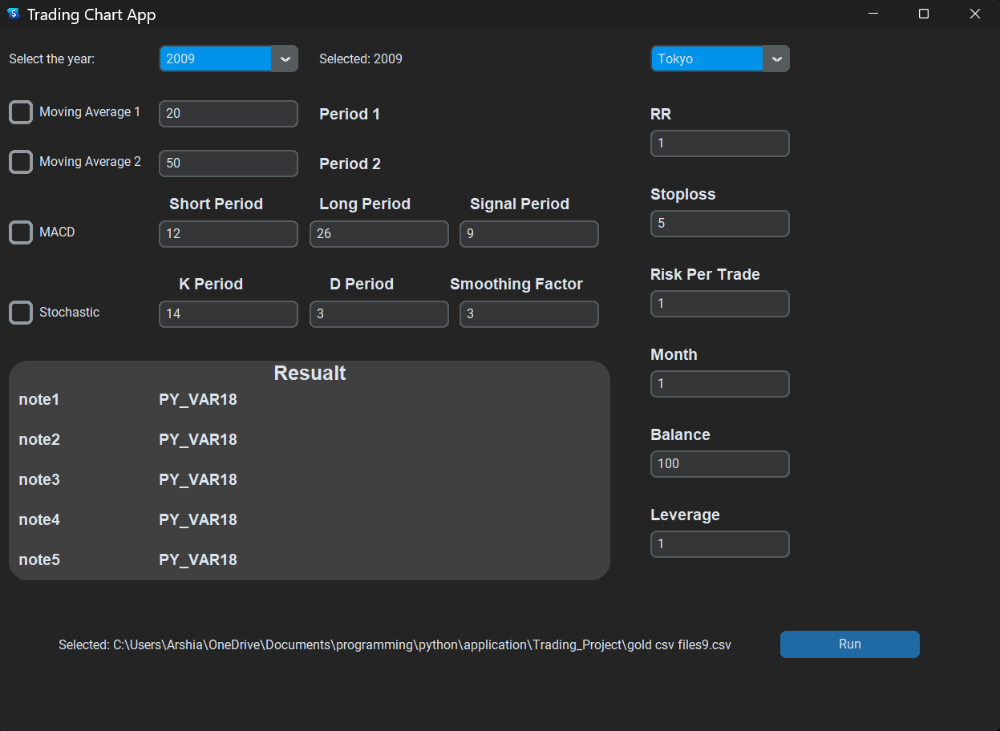

# 📈 AI-Based Trading Bot with GUI and Chart Analysis

This project is a complete **Python-based trading assistant** that combines:

- A modern **graphical user interface (GUI)** built with `CustomTkinter`
- Powerful **charting and indicator visualizations** using `Plotly`
- Support for **technical analysis algorithms** like Moving Average, MACD, and Stochastic
- A two-part structure for modularity: GUI & Algorithm modules are separate



---

## 🧠 Project Overview

This application allows users to:

- Interact through a user-friendly **GUI** to select indicators
- Display interactive **candlestick charts** from CSV data
- Apply **technical indicators** for trading analysis
- View real-time results through a **localhost** browser window

> 📌 Ideal for traders, developers, and researchers exploring strategy automation or visualization tools.

---

## 🧩 Project Structure

```
📁 trading-app
├── 📂 charts            # Contains Plotly-based chart visualizations
│   ├── final.py         # Handles technical indicator logic & chart rendering
│
├── 📂 gui               # Contains all CustomTkinter GUI logic
│   ├── UI.py            # Main GUI interface for user interaction
│
├── 📁 data              # Sample CSV files with historical market data
│
├── README.md           # Project documentation
├── requirements.txt    # List of required libraries
```

---

## 🧮 Supported Technical Indicators

### 1. 📊 Moving Average (MA)

Smooths out price data to identify trend direction. This project implements:

- Simple Moving Average (SMA)
- Exponential Moving Average (EMA)

### 2. 📉 MACD (Moving Average Convergence Divergence)

Detects changes in momentum by comparing fast and slow EMAs. Used to:

- Signal trend reversals
- Spot bullish/bearish divergences

### 3. 🔄 Stochastic Oscillator

Compares a security’s closing price to its price range over time. Great for:

- Identifying overbought/oversold conditions
- Confirming trend momentum

---

## 🖼️ User Interface (GUI)

- Built using **CustomTkinter** for modern appearance
- Clean layout with selectable indicators
- Visual feedback for user actions

&#x20;*(Replace with your image)*

---

## 🚀 How It Works

1. Load a CSV file containing historical stock or crypto data
2. Choose an indicator from the GUI
3. `final.py` processes the data and generates the chart using `Plotly`
4. Chart opens automatically in a web browser on `localhost`

---

## 🧠 Future Plans

- ✅ Add live data integration (e.g., using Binance or Yahoo Finance API)
- ✅ Support multiple strategies and backtesting
- ✅ Export results to Excel or PDF
- ✅ Add auto-trading engine using API keys

---

## 📚 Algorithms Behind the Scenes

Each indicator follows a clear mathematical formulation. For instance:

### 📌 Moving Average

```python
SMA = data['Close'].rolling(window=period).mean()
EMA = data['Close'].ewm(span=period, adjust=False).mean()
```

### 📌 MACD

```python
ema12 = data['Close'].ewm(span=12, adjust=False).mean()
ema26 = data['Close'].ewm(span=26, adjust=False).mean()
macd_line = ema12 - ema26
signal_line = macd_line.ewm(span=9, adjust=False).mean()
```

### 📌 Stochastic Oscillator

```python
low_min = data['Low'].rolling(window=14).min()
high_max = data['High'].rolling(window=14).max()
stochastic_k = 100 * ((data['Close'] - low_min) / (high_max - low_min))
```

These are then rendered using Plotly's `go.Candlestick()` and overlaid with line charts.

---
